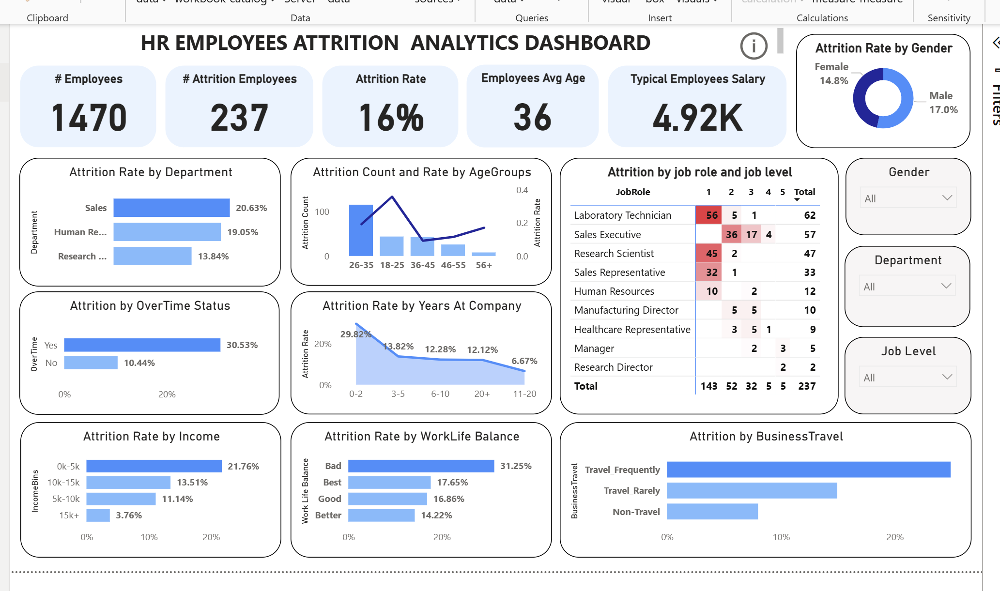
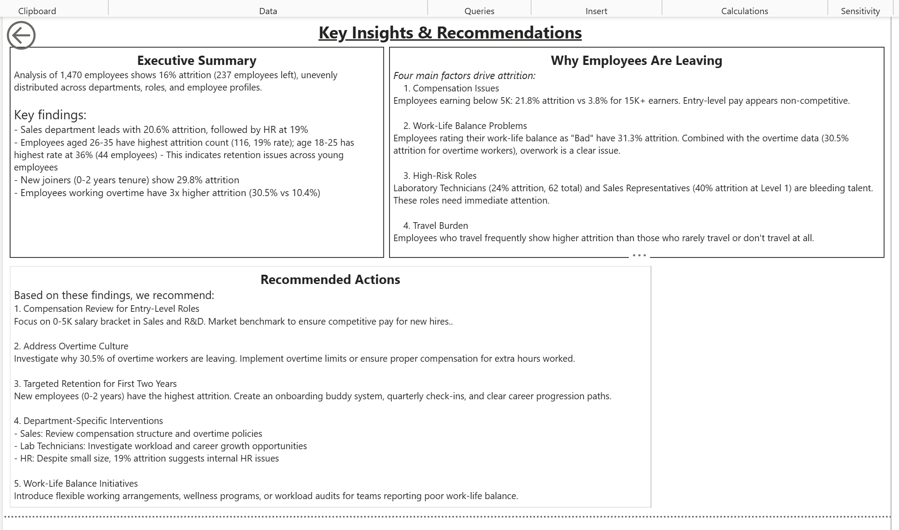

# HR Employee Attrition Analysis (Power BI)
Interactive Power BI dashboard analyzing employee attrition patterns across 1,470 employees to identify key drivers of turnover.

## 🎯 Project Objective
This project analyzes employee attrition patterns using HR data to identify key factors driving employee turnover. The analysis focuses on compensation, work-life balance, tenure, department differences, and travel requirements to provide actionable insights for improving employee retention.

---

## 📊 Dashboard Preview

### Overview Dashboard


### Insights & Recommendations


---

## 📁 Dataset

Source: IBM HR Attrition Dataset (Kaggle)  
https://www.kaggle.com/datasets/pavansubhasht/ibm-hr-analytics-attrition-dataset

This project uses an HR analytics dataset containing information on **1,470 employees** including demographic information, job roles, compensation, work-life balance ratings, and employment history.

Key attributes include:

- Age
- Department
- Job Role
- Monthly Income
- Years at Company
- Overtime Status
- Business Travel
- Work-Life Balance
- Attrition Status

---

## 🛠 Tools Used

- **Power BI** – Dashboard development and visualization
- **DAX** – Measures for attrition calculations
- **Data Cleaning** – Data preparation and validation
  
---

## 📈 Key Metrics

| Metric | Value |
|------|------|
| Total Employees | 1,470 |
| Employees Left | 237 |
| Attrition Rate | 16% |
| Average Age | 36 |
| Average Salary | 4.92K |

---

## 🔍 Key Attrition Drivers

### 1. Overtime Drives Attrition
Employees working overtime show **30.5% attrition**, compared to **10.4% for employees without overtime**, indicating overwork as a major factor.

### 2. Entry-Level Compensation Risk
Employees earning below 5K have a **21.8% attrition rate**, significantly higher than the **3.8% attrition rate for employees earning above 15K**.

### 3. Early Tenure Risk
Employees with **0–2 years at the company show nearly 30% attrition**, suggesting onboarding and early engagement issues.

### 4. Attrition Concentrated in Specific Roles
A large share of attrition comes from a small number of job roles, particularly Laboratory Technicians and Sales-related positions. This suggests retention issues are concentrated in operational and sales functions rather than evenly distributed across the organization.

### 5. Travel Requirements
Employees who **travel frequently** show higher attrition compared to those who travel rarely or do not travel.

---

## 💡 Recommendations

### 1. Improve Entry-Level Compensation
Benchmark salaries for entry-level employees to remain competitive and reduce early turnover.

### 2. Address Overtime Culture
Monitor excessive overtime and ensure proper compensation or workload balancing.

### 3. Strengthen Early Employee Engagement
Focus on onboarding programs, mentoring, and career development for employees within their first two years.

### 4. Investigate High-Risk Roles
Conduct targeted retention initiatives for roles with significantly higher attrition.

### 5. Improve Work-Life Balance
Introduce flexible work policies and employee wellness programs to improve retention.

---

## 📂 Repository Structure

```
powerbi-hr-attrition-analysis
│
├── dashboard
│   └── hr_attrition_dashboard.pbix
│
├── screenshots
│   ├── dashboard_overview.png
│   └── insights_page.png
│
└── README.md
```

---

## 🔗 Connect With Me

**Inderjeet Singh**  
Aspiring Data Analyst | SQL | Excel | Power BI

📧 Email: inderjeetsingh152005@gmail.com  
💼 LinkedIn: https://www.linkedin.com/in/inderjeet-singh-data/ 
💻 GitHub: https://github.com/inderjeet-singh-data

---

*Portfolio project for Data Analyst positions*
